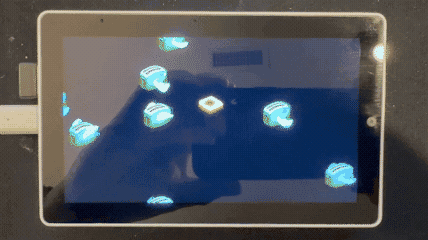

# BasiliskII ESP32 — Classic Macintosh Emulator for M5Stack Tab5

A full port of the **BasiliskII** Macintosh 68k emulator to the ESP32-P4 microcontroller, running on the M5Stack Tab5 hardware. This project brings classic Mac OS (System 7.x through Mac OS 8.1) to a portable embedded device with touchscreen input and USB peripheral support.


---

## Screenshots

<p align="center">
  
</p>

*Flying Toasters running smoothly after v2.5 performance optimizations*

<p align="center">
  
  
</p>

<p align="center">
  
  
</p>

<p align="center">
  <a href="screenshots.md">
    
  </a>
</p>

---

## Overview

This project runs a **Motorola 68040** emulator that can boot real Macintosh ROMs and run genuine classic Mac OS software. The emulation includes:

- **CPU**: Motorola 68040 emulation with FPU (68881)
- **RAM**: Configurable from 4MB to 16MB (allocated from ESP32-P4's 32MB PSRAM)
- **Display**: 640×360 virtual display (2× scaled to 1280×720 physical display)
- **Storage**: Hard disk and CD-ROM images loaded from SD card
- **Input**: Capacitive touchscreen (as mouse) + USB keyboard/mouse support

## Hardware

### [M5Stack Tab5](https://shop.m5stack.com/products/m5stack-tab5-iot-development-kit-esp32-p4)

The Tab5 features a unique **dual-chip architecture** that makes it ideal for this project:

| Chip | Role | Key Features |
|------|------|--------------|
| **ESP32-P4** | Main Application Processor | 400MHz dual-core RISC-V, 32MB PSRAM, MIPI-DSI display |
| **ESP32-C6** | Wireless Co-processor | WiFi 6, Bluetooth LE 5.0 (not used by emulator) |

### Key Specifications

| Component | Details |
|-----------|---------|
| **Display** | 5" IPS TFT, 1280×720 (720p), MIPI-DSI interface |
| **Touch** | Capacitive multi-touch (ST7123 controller) |
| **Memory** | 32MB PSRAM for emulated Mac RAM + frame buffers |
| **Storage** | microSD card slot for ROM, disk images, and settings |
| **USB** | Type-A host port for keyboard/mouse, Type-C for programming |
| **Battery** | NP-F550 Li-ion (2000mAh) for portable operation |

See [boardConfig.md](boardConfig.md) for detailed pin mappings and hardware documentation.

---

## Architecture

### Dual-Core Design

The emulator leverages the ESP32-P4's dual-core RISC-V architecture for optimal performance:

```
┌─────────────────────────────────────────────────────────────────┐
│                        ESP32-P4 (400MHz)                        │
├────────────────────────────┬────────────────────────────────────┤
│         CORE 0             │              CORE 1                │
│    (Video & I/O Core)      │       (CPU Emulation Core)         │
├────────────────────────────┼────────────────────────────────────┤
│  • Video rendering task    │  • 68040 CPU interpreter           │
│  • 8-bit to RGB565 convert │  • Memory access emulation         │
│  • 2×2 pixel scaling       │  • Interrupt handling              │
│  • Touch input processing  │  • ROM patching                    │
│  • USB HID polling         │  • Disk I/O                        │
│  • ~15 FPS refresh rate    │  • 40,000 instruction quantum      │
└────────────────────────────┴────────────────────────────────────┘
```

### Memory Layout

```
┌──────────────────────────────────────────────────────────────┐
│                    32MB PSRAM Allocation                     │
├──────────────────────────────────────────────────────────────┤
│  Mac RAM (4-16MB)          │  Configurable via Boot GUI      │
├────────────────────────────┼─────────────────────────────────┤
│  Mac ROM (~1MB)            │  Q650.ROM or compatible         │
├────────────────────────────┼─────────────────────────────────┤
│  Mac Frame Buffer (230KB)  │  640×360 @ 8-bit indexed color  │
├────────────────────────────┼─────────────────────────────────┤
│  Display Buffer (1.8MB)    │  1280×720 @ RGB565              │
├────────────────────────────┼─────────────────────────────────┤
│  Free PSRAM                │  Varies based on RAM selection  │
└──────────────────────────────────────────────────────────────┘
```

### Video Pipeline

The video system uses an optimized pipeline for converting the Mac's 8-bit indexed framebuffer to the display:

1. **68040 CPU** writes to emulated Mac framebuffer (640×360, 8-bit indexed)
2. **Video Task** (Core 0) reads framebuffer at ~15 FPS
3. **Palette Lookup** converts 8-bit indices to RGB565
4. **2×2 Scaling** doubles pixels horizontally and vertically
5. **DMA Transfer** pushes 1280×720 RGB565 buffer to MIPI-DSI display

---

## Emulation Details

### BasiliskII Components

This port includes the following BasiliskII subsystems, adapted for ESP32:

| Component | File(s) | Description |
|-----------|---------|-------------|
| **UAE CPU** | `uae_cpu/*.cpp` | Motorola 68040 interpreter |
| **ADB** | `adb.cpp` | Apple Desktop Bus for keyboard/mouse |
| **Video** | `video_esp32.cpp` | Display driver with 2× scaling |
| **Disk** | `disk.cpp`, `sys_esp32.cpp` | HDD image support via SD card |
| **CD-ROM** | `cdrom.cpp` | ISO image mounting |
| **XPRAM** | `xpram_esp32.cpp` | Non-volatile parameter RAM |
| **Timer** | `timer_esp32.cpp` | 60Hz/1Hz tick generation |
| **ROM Patches** | `rom_patches.cpp` | Compatibility patches for ROMs |
| **Input** | `input_esp32.cpp` | Touch + USB HID handling |

### Supported ROMs

The emulator works best with **Macintosh Quadra** series ROMs:

| ROM File | Machine | Recommended |
|----------|---------|-------------|
| `Q650.ROM` | Quadra 650 | ✅ Best compatibility |
| `Q700.ROM` | Quadra 700 | ✅ Good |
| `Q800.ROM` | Quadra 800 | ✅ Good |
| `68030-IIci.ROM` | Mac IIci | ⚠️ May work |

### Supported Operating Systems

| OS Version | Status | Notes |
|------------|--------|-------|
| System 7.1 | ✅ Works | Lightweight, fast boot |
| System 7.5.x | ✅ Works | Good compatibility |
| Mac OS 8.0 | ✅ Works | Full-featured |
| Mac OS 8.1 | ✅ Works | Latest supported |

---

## Getting Started

### Prerequisites

- **Hardware**: M5Stack Tab5
- **Software**: [PlatformIO](https://platformio.org/) (CLI or IDE extension)
- **SD Card**: FAT32 formatted microSD card (8GB+ recommended)

### SD Card Setup

#### Quick Start (Recommended)

Download a ready-to-use SD card image with Mac OS pre-installed:

**[📥 Download sdCard.zip](https://mcchord.net/static/sdCard.zip)**

1. Format your microSD card as **FAT32**
2. Extract the ZIP contents to the **root** of the SD card
3. Insert into Tab5 and boot

#### Manual Setup

Alternatively, create your own setup with these files in the SD card root:

```
/
├── Q650.ROM              # Macintosh Quadra ROM (required)
├── Macintosh.dsk         # Hard disk image (required)
├── System753.iso         # Mac OS installer CD (optional)
└── DiskTools1.img        # Boot floppy for installation (optional)
```

To create a blank disk image:

```bash
# Create a 500MB blank disk image
dd if=/dev/zero of=Macintosh.dsk bs=1M count=500
```

Then format it during Mac OS installation.

### Flashing the Firmware

#### Option 1: Pre-built Firmware (Easiest)

Download the latest release from GitHub:

**[📥 Download Latest Release](https://github.com/amcchord/M5Tab-Macintosh/releases/latest)**

Flash the single merged binary using `esptool.py`:

```bash
# Install esptool if you don't have it
pip install esptool

# Flash the merged binary (connect Tab5 via USB-C)
esptool.py --chip esp32p4 \
    --port /dev/ttyACM0 \
    --baud 921600 \
    write_flash \
    0x0 M5Tab-Macintosh-v2.0.1.bin
```

**Note**: Replace `/dev/ttyACM0` with your actual port:
- **macOS**: `/dev/cu.usbmodem*` or `/dev/tty.usbmodem*`  
  (Run `ls /dev/cu.*` to find available ports)
- **Windows**: `COM3` (or similar, check Device Manager)
- **Linux**: `/dev/ttyACM0` or `/dev/ttyUSB0`

**Troubleshooting Flash Issues**:
- If flashing fails, try a lower baud rate: `--baud 460800` or `--baud 115200`
- If the device isn't detected, hold the **BOOT** button while pressing **RESET** to enter bootloader mode
- On some systems you may need to run with `sudo` or add your user to the `dialout` group

#### Option 2: Build from Source

```bash
# Clone the repository
git clone https://github.com/amcchord/M5Tab-Macintosh.git
cd M5Tab-Macintosh

# Build the firmware
pio run

# Upload to device (connect via USB-C)
pio run --target upload

# Monitor serial output
pio device monitor
```

---

## Boot GUI

On startup, a **classic Mac-style boot configuration screen** appears:

```
┌─────────────────────────────────────────┐
│           BasiliskII                    │
│        Starting in 3...                 │
│                                         │
│    Disk: Macintosh.dsk                  │
│    RAM: 8 MB                            │
│                                         │
│  ┌─────────────────────────────────┐    │
│  │       Change Settings           │    │
│  └─────────────────────────────────┘    │
└─────────────────────────────────────────┘
```

### Features

- **3-second countdown** to auto-boot with saved settings
- **Tap to configure** disk images, CD-ROMs, and RAM size
- **Settings persistence** saved to `/basilisk_settings.txt` on SD card
- **Touch-friendly** large buttons designed for the 5" touchscreen

### Configuration Options

| Setting | Options | Default |
|---------|---------|---------|
| Hard Disk | Any `.dsk` or `.img` file on SD root | First found |
| CD-ROM | Any `.iso` file on SD root, or None | None |
| RAM Size | 4 MB, 8 MB, 12 MB, 16 MB | 8 MB |

---

## Input Support

### Touch Screen

The capacitive touchscreen acts as a single-button mouse:

- **Tap** = Click
- **Drag** = Click and drag
- Coordinates are scaled from 1280×720 display to 640×360 Mac screen

### USB Keyboard

Connect a USB keyboard to the **USB Type-A port**. Supported features:

- Full QWERTY layout with proper Mac key mapping
- Modifier keys: Command (⌘), Option (⌥), Control, Shift
- Function keys F1-F15
- Arrow keys and navigation cluster
- Numeric keypad
- **Caps Lock LED** sync with Mac OS

### USB Mouse

Connect a USB mouse for relative movement input:

- Left, right, and middle button support
- Relative movement mode (vs. absolute for touch)

---

## Project Structure

```
M5Tab-Macintosh/
├── src/
│   ├── main.cpp                    # Application entry point
│   └── basilisk/                   # BasiliskII emulator core
│       ├── main_esp32.cpp          # Emulator initialization & main loop
│       ├── video_esp32.cpp         # Display driver (2× scaling, RGB565)
│       ├── input_esp32.cpp         # Touch + USB HID input handling
│       ├── boot_gui.cpp            # Pre-boot configuration GUI
│       ├── sys_esp32.cpp           # SD card disk I/O
│       ├── timer_esp32.cpp         # 60Hz/1Hz interrupt generation
│       ├── xpram_esp32.cpp         # NVRAM persistence to SD
│       ├── prefs_esp32.cpp         # Preferences loading
│       ├── uae_cpu/                # Motorola 68040 CPU emulator
│       │   ├── newcpu.cpp          # Main CPU interpreter loop
│       │   ├── memory.cpp          # Memory banking & access
│       │   └── generated/          # CPU instruction tables
│       └── include/                # Header files
├── platformio.ini                  # PlatformIO build configuration
├── partitions.csv                  # ESP32 flash partition table
├── boardConfig.md                  # Hardware documentation
└── scripts/                        # Build helper scripts
```

---

## Performance

### Benchmarks (Approximate)

| Metric | Value |
|--------|-------|
| CPU Quantum | 40,000 instructions per tick |
| Video Refresh | ~15 FPS |
| Boot Time | ~15 seconds to Mac OS desktop |
| Responsiveness | Usable for productivity apps |

### Optimization Techniques

1. **Dual-core separation**: CPU emulation and video rendering run independently
2. **Large instruction quantum**: Fewer context switches = faster emulation
3. **Direct framebuffer access**: No intermediate copies
4. **Optimized 4-pixel batch processing**: Reduced loop overhead in scaling
5. **Polling-based interrupts**: Safer than async timers for stability

---

## Build Configuration

Key build flags in `platformio.ini`:

```ini
build_flags =
    -O2                          # Optimize for speed
    -DEMULATED_68K=1             # Use 68k interpreter
    -DREAL_ADDRESSING=0          # Use memory banking
    -DROM_IS_WRITE_PROTECTED=1   # Protect ROM from writes
    -DFPU_IEEE=1                 # IEEE FPU emulation
```

---

## Troubleshooting

### Common Issues

| Problem | Solution |
|---------|----------|
| "SD card initialization failed" | Ensure SD card is FAT32, properly seated |
| "Q650.ROM not found" | Place ROM file in SD card root directory |
| Black screen after boot | Check serial output for errors; verify ROM compatibility |
| Touch not responding | Wait for boot GUI to complete initialization |
| USB keyboard not working | Connect to Type-A port (not Type-C) |
| Slow/choppy display | Normal; emulator runs at ~15 FPS |

### Serial Debug Output

Connect via USB-C and use:

```bash
pio device monitor
```

Look for initialization messages:

```
========================================
  BasiliskII ESP32 - Macintosh Emulator
  Dual-Core Optimized Edition
========================================

[MAIN] Free heap: 473732 bytes
[MAIN] Free PSRAM: 31676812 bytes
[MAIN] Total PSRAM: 33554432 bytes
[MAIN] CPU Frequency: 360 MHz
[MAIN] Running on Core: 1
[PREFS] Loading preferences...
[PREFS] RAM: 16 MB
[PREFS] Disk: /Macintosh8.dsk (read-write)
[PREFS] CD-ROM: None
[PREFS] Preferences loaded
[SYS] SD card should already be initialized by main.cpp
[MAIN] Allocating 16777216 bytes for Mac RAM...
[MAIN] Mac RAM allocated at 0x481ca674 (16777216 bytes)
[MAIN] Loading ROM from: /Q650.ROM
[MAIN] ROM file size: 1048576 bytes
```

---

## Acknowledgments

- **BasiliskII** by Christian Bauer and contributors — the original open-source 68k Mac emulator
- **UAE** (Unix Amiga Emulator) — the CPU emulation core
- **[M5Stack](https://shop.m5stack.com/products/m5stack-tab5-iot-development-kit-esp32-p4)** — for the excellent Tab5 hardware and M5Unified/M5GFX libraries
- **EspUsbHost** — USB HID support for ESP32
- **Claude Opus 4.5** (Anthropic) — AI pair programmer that made this port possible

---

## License

This project is based on BasiliskII, which is licensed under the **GNU General Public License v2**.

---


*This project was built with the assistance of [Claude Opus 4.5](https://anthropic.com). I am in no way smart enough to have done this on my own.* 🤖🍎

*Run classic Mac OS in your pocket.*
